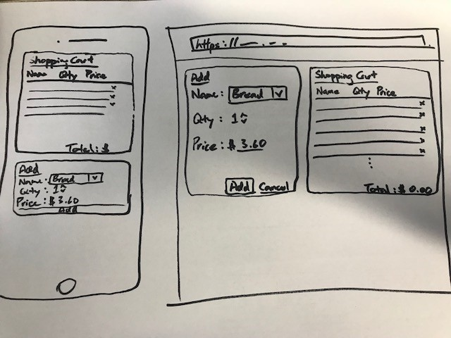

# AMP Angular interview seed repo
A seed Angular repo, to give candidate a common starting point to demonstrate their skills.

# Task
Develop a simple Shopping cart application.
- Please spend no more than two hours on this as will shown by commit timestamps, comment on what was done and what wasn't

## Features
- [x] Add/Update/Delete of item (CRUD)
- [x] An up to date list of item in the shopping cart

## Constraints
- Feel free to pull in Angular Materials
- Free to use CSS libraries (Bootstrap, Fontawesome, Ionic)
- Free to use 3rd party libraries but be prepare to justify your choice
- App needs to compile and run, ideally via stackblitz

## Area of demonstration
- Modularity
- Usage of service(s)
- Unit test
- CSS clarity - feel free to use SCSS/SASS/LESS
- Quality of code over quantity of code
- Responsive design
- code comments to outline your thinking
- use github repo

### Bonus points
- Sorting/Filtering by category, name, price, etc
- Performance focus

# Demo via stackblitz
https://stackblitz.com/github/ampdigital/interview-angular

# Submit your code
Simply fork this repository to get your copy to work on. Make your copy private but visible to onetonnesam@gmail.com.
Once you are ready to submit, create a pull request.
Please refer to https://guides.github.com/activities/forking/

** Below are auto-generated README content **
# ShoppingCartApp

This project was generated with [Angular CLI](https://github.com/angular/angular-cli) version 6.0.0.

## Development server

Run `ng serve` for a dev server. Navigate to `http://localhost:4200/`. The app will automatically reload if you change any of the source files.

## Code scaffolding

Run `ng generate component component-name` to generate a new component. You can also use `ng generate directive|pipe|service|class|guard|interface|enum|module`.

## Build

Run `ng build` to build the project. The build artifacts will be stored in the `dist/` directory. Use the `--prod` flag for a production build.

## Running unit tests

Run `ng test` to execute the unit tests via [Karma](https://karma-runner.github.io).

## Running end-to-end tests

Run `ng e2e` to execute the end-to-end tests via [Protractor](http://www.protractortest.org/).

## Further help

To get more help on the Angular CLI use `ng help` or go check out the [Angular CLI README](https://github.com/angular/angular-cli/blob/master/README.md).
